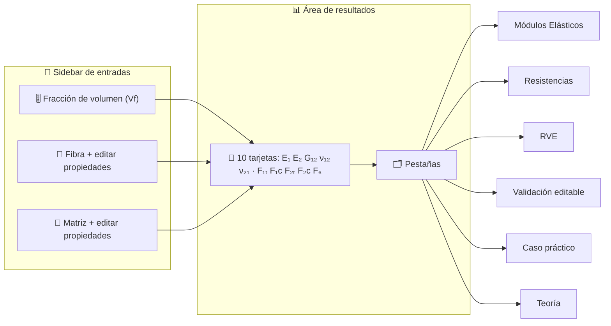
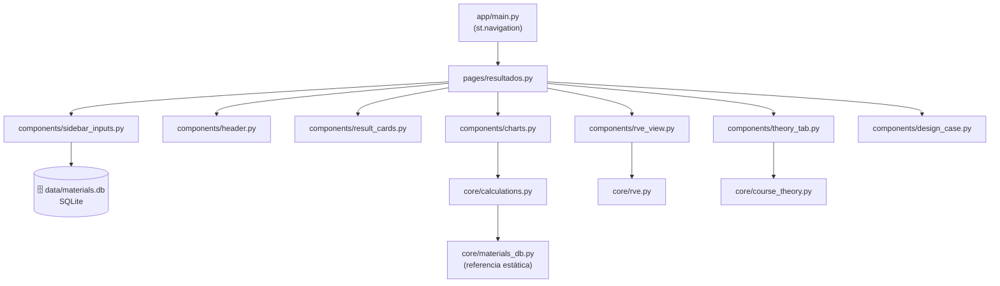

<div align="center">

# 🔬 Micromecánica de Materiales Compuestos

### Predictor micromecánico interactivo de la lámina unidireccional (UD)

*De las propiedades de fibra y matriz a las propiedades efectivas del compuesto: rigidez, resistencia, RVE y teoría, en una sola app.*

[](https://www.python.org/)
[](https://streamlit.io/)
[](https://plotly.com/python/)
[](https://www.sqlite.org/)

[](#-pruebas)
[](#-modelos-micromec%C3%A1nicos)
[](#)
[](#)
[](#-licencia-y-cr%C3%A9ditos)

</div>

---

## 📖 Tabla de contenidos

- [Descripción](#-descripción)
- [Características](#-características)
- [Vista rápida de la interfaz](#-vista-rápida-de-la-interfaz)
- [Arquitectura](#-arquitectura)
- [Modelos micromecánicos](#-modelos-micromecánicos)
- [Base de datos de materiales (SQLite)](#-base-de-datos-de-materiales-sqlite)
- [RVE geométricamente periódico](#-rve-geométricamente-periódico)
- [Instalación](#-instalación)
- [Ejecución](#-ejecución)
- [Uso de la aplicación](#-uso-de-la-aplicación)
- [Pruebas](#-pruebas)
- [Desarrollo guiado por especificaciones (SDD)](#-desarrollo-guiado-por-especificaciones-sdd)
- [Convenciones y unidades](#-convenciones-y-unidades)
- [Publicar en GitHub (buenas prácticas)](#-publicar-en-github-buenas-prácticas)
- [Roadmap](#-roadmap)
- [Licencia y créditos](#-licencia-y-créditos)

---

## 🧭 Descripción

Aplicación educativa e interactiva que implementa la **micromecánica de la lámina unidireccional (UD)** vista en la Unidad 2 del curso *Diseño y Análisis de Materiales Compuestos* (Universidad de Concepción).

A partir de las propiedades de los constituyentes (fibra y matriz) y de la fracción volumétrica de fibra `Vf`, la app predice las **4 constantes elásticas** y las **5 resistencias** de la lámina, las compara con valores experimentales de referencia, explora el **espacio de diseño**, resuelve un **diseño inverso** y genera un **RVE periódico realista**.

> 🎯 **Idea central:** el material compuesto no se selecciona, **se diseña**. La micromecánica permite predecir su comportamiento antes de fabricar una sola probeta.

---

## ✨ Características

| | Característica | Detalle |
|---|---|---|
| 🎛️ | **Panel lateral persistente** | `Vf`, selección de fibra/matriz desde base de datos y edición de propiedades |
| 🗂️ | **Base de datos editable** | Fibras y matrices en **SQLite** (insertar, guardar, editar, eliminar) |
| 🧮 | **Cálculo unificado** | Una sola capa física (`core/calculations.py`), idéntica al notebook del curso |
| 📊 | **6 pestañas analíticas** | Módulos · Resistencias · RVE · Validación · Caso práctico · Teoría |
| 🧩 | **RVE geométricamente periódico** | Copias periódicas, distancia mínima-imagen, sin solapes y `Vf` logrado ≤ objetivo |
| 📋 | **Validación editable** | Referencias experimentales editables para el compuesto seleccionado |
| 🚲 | **Caso práctico de diseño inverso** | Requisitos editables, `Vf` mínimo, comparación de rigidez específica y gráfico de cumplimiento |
| 📐 | **Etiquetas en notación de ingeniería** | `E₁, ν₁₂, σ₁, θ…` renderizadas de forma nativa |
| 📚 | **Pestaña de Teoría** | Conceptos y fórmulas del curso (U1 + U2) con `st.latex` (KaTeX offline) |
| 🎨 | **Tema claro "papel sepia"** | Tipografía monoespaciada, paleta sobria y sin CSS/HTML inyectado |
| ⚡ | **Rápida** | Componentes nativos de Streamlit + `@st.cache_data` en barridos y RVE |
| ✅ | **Con pruebas** | 41 pruebas unitarias y de contrato de UI |

---

## 🖼️ Vista rápida de la interfaz



> 💡 **Sugerencia:** agrega capturas reales en `docs/` y enlázalas aquí.
>
> ```markdown
> 
> 
> ```

---

## 🏗️ Arquitectura

Principio de diseño: **la lógica de dominio vive en `core/` y la UI no contiene física.**



### Estructura del proyecto

```text
proyecto01/
├── app/
│   ├── main.py                 # Entrada única (st.navigation)
│   ├── core/                   # Lógica de dominio (sin Streamlit)
│   │   ├── calculations.py     # ROM, Halpin-Tsai, Rosen, Barbero
│   │   ├── micromechanics.py   # Envoltorios finos sobre calculations
│   │   ├── material_db.py      # CRUD SQLite de fibras y matrices
│   │   ├── materials_db.py     # Materiales de referencia del curso
│   │   ├── rve.py              # Generador de RVE periódico
│   │   ├── course_theory.py    # Contenido de la pestaña Teoría (U1+U2)
│   │   ├── models.py           # Dataclasses de dominio
│   │   └── theory.py           # Contenido teórico (SPEC-02)
│   ├── components/             # Componentes de UI (Streamlit nativo)
│   │   ├── sidebar_inputs.py
│   │   ├── header.py
│   │   ├── result_cards.py
│   │   ├── charts.py
│   │   ├── rve_view.py             # Visualización de la celda periódica
│   │   ├── results_tables.py       # Tablas y editor de validación
│   │   └── design_case.py          # Caso práctico de diseño inverso
│   │   └── theory_tab.py
│   ├── pages/
│   │   └── resultados.py       # Página activa
│   └── styles/theme.py         # Tokens (herencia del rediseño)
├── data/
│   └── materials.db            # Base SQLite (generada al primer uso)
├── specs/                      # Especificaciones (SDD)
├── tests/unit/                 # 41 pruebas
├── .streamlit/config.toml      # Tema claro sepia + monospace
├── requirements.txt
└── README.md
```

---

## 🧮 Modelos micromecánicos

Todos los modelos provienen **exclusivamente** del contenido del curso (U2) y del notebook de la tarea.

| Propiedad | Modelo | Fórmula | Confiabilidad |
|---|---|---|---|
| `E₁` | Regla de Mezclas (isostrain) | $E_1 = V_f E_{f1} + V_m E_m$ | ★★★★★ |
| `ν₁₂` | Regla de Mezclas | $\nu_{12} = V_f \nu_f + V_m \nu_m$ | ★★★★☆ |
| `E₂` | Halpin-Tsai (ξ = 2) | $E_2 = E_m \dfrac{1 + 2\eta V_f}{1 - \eta V_f}$ | ★★★★☆ |
| `G₁₂` | Halpin-Tsai (ξ = 1) | $G_{12} = G_m \dfrac{1 + \eta V_f}{1 - \eta V_f}$ | ★★★☆☆ |
| `ν₂₁` | Reciprocidad elástica | $\nu_{21} = \nu_{12}\, E_2 / E_1$ | ★★★★☆ |
| `F₁ₜ` | ROM con dominancia de fibra | $F_{1t} = V_f F_f^{u} + V_m E_m \varepsilon_f^{u}$ | ★★★★★ |
| `F₁c` | Rosen + práctica 0.575·F₁ₜ | $F_{1c} = 0.575\,F_{1t}$ | ★★★☆☆ |
| `F₂ₜ` | Barbero | $F_{2t} = F_{tu,m}\left[1 - \eta\left(1 - \tfrac{E_m}{E_{f2}}\right)\right]$ | ★★☆☆☆ |
| `F₆` | Barbero | $F_6 = \dfrac{F_{tu,m}}{\sqrt{3}}\left[1 - \eta\left(1 - \tfrac{G_m}{G_{f12}}\right)\right]$ | ★★☆☆☆ |
| `F₂c` | Estimación empírica | $F_{2c} = 4\,F_{2t}$ | ★☆☆☆☆ |

Donde el factor geométrico de Barbero es $\eta = \sqrt{4V_f/\pi} - V_f$ y el de Halpin-Tsai es $\eta = \dfrac{P_f/P_m - 1}{P_f/P_m + \xi}$.

> ⚠️ Las resistencias transversales y a cortante son las más difíciles de predecir. Se reportan con su nivel de confianza y **no reemplazan la caracterización experimental** para diseño final.

**Sistemas de referencia incluidos:**

| Sistema | Vf | Notas |
|---|---|---|
| `IM7 / 8552 (CFRP)` | 0.60 | Fibra de carbono de módulo intermedio; matriz epoxi aeroespacial |
| `E-glass / Epoxi (GFRP)` | 0.55 | Fibra de vidrio isotrópica; caso de contraste |

---

## 🗄️ Base de datos de materiales (SQLite)

Base ligera en `data/materials.db` (biblioteca estándar `sqlite3`, **sin dependencias extra**), creada y sembrada automáticamente.

**Esquema — `fibers`**

| Columna | Unidad | Descripción |
|---|---|---|
| `name` | — | Nombre de la fibra (clave) |
| `E1`, `E2`, `G12` | GPa | Módulos longitudinal, transversal y de corte |
| `nu12` | — | Coeficiente de Poisson |
| `F1t` | MPa | Resistencia última a tracción |
| `etu` | — | Deformación última |
| `density` | kg/m³ | Densidad |
| `d_min`, `d_max` | µm | Rango de diámetro de fibra (para el RVE) |

**Esquema — `matrices`**: `name, E (GPa), nu, G (GPa), Ft (MPa), density (kg/m³)`.

**Materiales sembrados**

| Fibras | Matrices |
|---|---|
| IM7 · E-glass · Carbon T300 · Carbon M40J · Kevlar-49 | Epoxi 8552 · Epoxi GFRP · Epoxy 3501-6 · Poliéster · PEEK |

> 🧩 La UI permite **insertar, editar, guardar y eliminar** materiales; los cambios persisten entre sesiones.

---

## 🧩 RVE geométricamente periódico

El **RVE** (*Representative Volume Element*) es la región más pequeña que conserva las proporciones de fibra y matriz. La aplicación lo representa como una **celda geométricamente periódica**:

- 🔁 Cada fibra tiene copias trasladadas en ±`L` y, cuando cruza un borde, reaparece por el borde opuesto.
- 🎯 La fracción volumétrica se calcula como `Vf = Σ π rᵢ² / L²`; cada fibra base se cuenta una sola vez y el valor logrado no supera el objetivo.
- 📏 La no-superposición se verifica con la **distancia mínima-imagen**, considerando las copias periódicas de la celda.
- 🧱 Colocación por **relajación/compresión** (estilo Lubachevsky–Stillinger), que alcanza densidades altas (~0.60) donde el RSA se estanca (~0.547).
- 🔒 El **Vf objetivo nunca se supera**; si no es alcanzable, se reporta el máximo factible.

La periodicidad verificada aquí es **geométrica y topológica para la representación 2D**. El código no resuelve todavía un problema de elementos finitos con grados de libertad o tracciones periódicas; por tanto, no debe interpretarse como una validación de condiciones periódicas mecánicas. La pestaña permite editar la **semilla**: la misma semilla reproduce exactamente la misma realización y cambiarla genera otra distribución aleatoria con igual objetivo de `Vf`.

Parámetros por defecto: **RVE 50 × 50 µm**, diámetro IM7 5–7 µm y E-glass 13–17 µm (según la directriz de la Tarea 1). La realización es determinista para una semilla fija y puede regenerarse desde la pestaña RVE.

---

## ⚙️ Instalación

Requisitos: **Python 3.12+**.

```bash
# 1. Clonar
git clone <URL-del-repositorio>
cd proyecto01

# 2. Activar el entorno virtual existente en la raíz del workspace
# Windows (PowerShell, desde proyecto01/):
..\venv\Scripts\Activate.ps1
# Linux / macOS, desde proyecto01/:
source ../venv/bin/activate

# 3. Instalar dependencias
pip install -r requirements.txt
```

---

## ▶️ Ejecución

```bash
# Desde la carpeta proyecto01/
streamlit run app/main.py

# Alternativa desde la raíz del curso
streamlit run proyecto01/app/main.py
```

Luego abre 👉 **http://localhost:8501**

> 🎨 El tema (papel sepia + tipografía monoespaciada) se define en `.streamlit/config.toml`; **no** se inyecta CSS ni HTML desde Python.

---

## 🕹️ Uso de la aplicación

1. **Ajusta `Vf`** en el sidebar (fracción volumétrica de fibra).
2. **Selecciona fibra y matriz** desde los desplegables (o edítalas y guárdalas en la base).
3. Observa las **10 tarjetas** de propiedades actualizadas en tiempo real.
4. Navega por las pestañas:

| Pestaña | Qué muestra |
|---|---|
| **Módulos Elásticos** | `E₁, E₂, G₁₂` y `ν₁₂` vs `Vf` |
| **Resistencias** | `F₁ₜ` y `F₁c` vs `Vf` para la fibra y matriz seleccionadas |
| **RVE** | Celda 2D geométricamente periódica, copias de borde, `Vf` y no-superposición |
| **Validación** | Tabla del sistema seleccionado; valores experimentales editables y error porcentual |
| **Caso práctico** | Diseño inverso del tubo de bicicleta: `E₁`, `F₁ₜ`, `Vf` mínimo y `E₁/ρ` |
| **Teoría** | Conceptos y fórmulas del curso (U1 + U2) |

---

## ✅ Pruebas

Desde la carpeta `proyecto01/`:

```bash
# Windows
..\venv\Scripts\python.exe -m pytest . -q

# Linux / macOS
../venv/bin/python -m pytest . -q
```

**Estado actual:** ✅ `41 passed`

<details>
<summary>Ver cobertura de las pruebas</summary>

- **Cálculos** (`test_spec01_calculations.py`): reproduce los valores del notebook.
- **Contrato de UI** (`test_spec01_ui_contract.py`): tablas, RVE, selector.
- **Teoría** (`test_spec02_theory.py`, `test_spec09_theory.py`): secciones y fórmulas.
- **Interfaz** (`test_spec03_interfaz.py`): `AppTest` sobre `main.py`.
- **Paramétrico / inverso** (`test_spec04`, `test_spec05`).
- **Base de materiales** (`test_spec07_material_db.py`): CRUD y semilla.
- **UI nativa** (`test_spec08_ui_native.py`): sin `unsafe_allow_html`, tema, etiquetas sin MathJax.
- **RVE** (`test_spec10_rve.py`): sin solapes periódicos, `Vf ≤ objetivo`, determinismo y copias que cruzan los bordes.

</details>

---

## 📐 Desarrollo guiado por especificaciones (SDD)

Cada archivo declara su contrato con un encabezado `# Implements: specs/<archivo>.md`. El directorio `specs/` es la **fuente de verdad**.

| Spec | Tema |
|---|---|
| `01-visualizacion-resultados.md` | Visualización de resultados y validación |
| `02-espacio-teoria-analisis.md` | Espacio de teoría y análisis |
| `03-interfaz-limpia.md` | Interfaz limpia y accesible |
| `04-estudio-parametrico.md` | Estudio paramétrico (`Vf` vs propiedades) |
| `05-diseno-inverso.md` | Diseño inverso (tubo de bicicleta) |
| `06-seleccion-materiales.md` | Selección y edición de materiales |
| `07-base-materiales.md` | Base de datos SQLite |
| `08-interfaz-vintage-unificada.md` | Interfaz nativa, tema sepia y cálculos unificados |
| `09-teoria-curso.md` | Pestaña de teoría (U1 + U2) |
| `10-rve.md` | RVE geométricamente periódico (celda 2D) |

---

## 📏 Convenciones y unidades

| Magnitud | Unidad en UI | Unidad interna |
|---|---|---|
| Módulos (`E`, `G`) | GPa | MPa (`× 1000`) |
| Resistencias | MPa | MPa |
| Densidad | kg/m³ | kg/m³ |
| Diámetros / RVE | µm | µm |

- 📊 Gráficos con `st.plotly_chart(..., width="stretch")` y líneas delgadas (~1.3 px).
- 🔤 Etiquetas de ejes en notación de ingeniería (`E₁`, `ν₁₂`, `σ₁`, `θ`).
- 🧪 Cada cálculo se realiza en MPa y se convierte a GPa solo para mostrar.
- 🚫 Sin `unsafe_allow_html`: toda la interfaz es **Streamlit nativo**.

---

## 🚀 Publicar en GitHub (buenas prácticas)

```bash
# 1. Verifica el estado y qué se subirá
git status
git add README.md app/ tests/
git commit -m "docs: update application documentation"

# 2. Publica una rama de trabajo y abre el Pull Request en GitHub
git push -u origin feat/yenny
```

**Recomendaciones**

- 🧹 El `.gitignore` ya excluye `__pycache__/`, `*.pyc`, `.pytest_cache/` y `data/materials.db` (la base se regenera sola).
- 🔐 Nunca subas credenciales ni rutas absolutas; el código es portable.
- 🏷️ Configura en GitHub: **About**, **Topics** (`composites`, `micromechanics`, `streamlit`, `plotly`, `python`, `materials-science`) y una **licencia**.
- 🧪 Documenta cómo correr las pruebas (sección [Pruebas](#-pruebas)).
- 🖼️ Agrega capturas reales en `docs/` y enlázalas en la sección [Vista rápida](#-vista-rápida-de-la-interfaz).
- 📝 Usa mensajes de commit claros (Conventional Commits: `feat:`, `fix:`, `docs:`…).

---

## 🗺️ Roadmap

- [ ] Exportar resultados a CSV/JSON y guardar configuraciones.
- [ ] Modo comparación de múltiples sistemas en una sola vista.
- [ ] Extender a elasticidad anisótropa (U3): matrices `[Q]`, `[S]`, `[Q̄]`.
- [ ] Criterios de fallo adicionales (Hashin, Tsai-Hill) y fallo progresivo ply-by-ply.
- [ ] Empaquetamientos hexagonal/cuadrado y validación estadística del RVE.

---

## 📜 Licencia y créditos

- **Uso académico.** Proyecto desarrollado para el curso *Diseño y Análisis de Materiales Compuestos*, Departamento de Ingeniería Mecánica, **Universidad de Concepción** (2026).
- Basado en el notebook `tarea_01.ipynb` y en las unidades **U1** y **U2** del curso (C. Lanziotti, A. Salas).
- Referencia principal de las ecuaciones: **Barbero, E. J. (2011).** *Introduction to Composite Materials Design*, 2nd ed., CRC Press.

> 💚 Hecho con Python, Streamlit y Plotly.

<div align="center">

**[⬆ Volver arriba](#-micromecánica-de-materiales-compuestos)**

</div>
